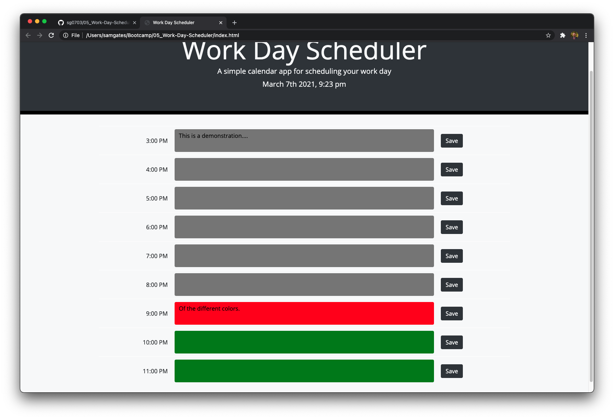
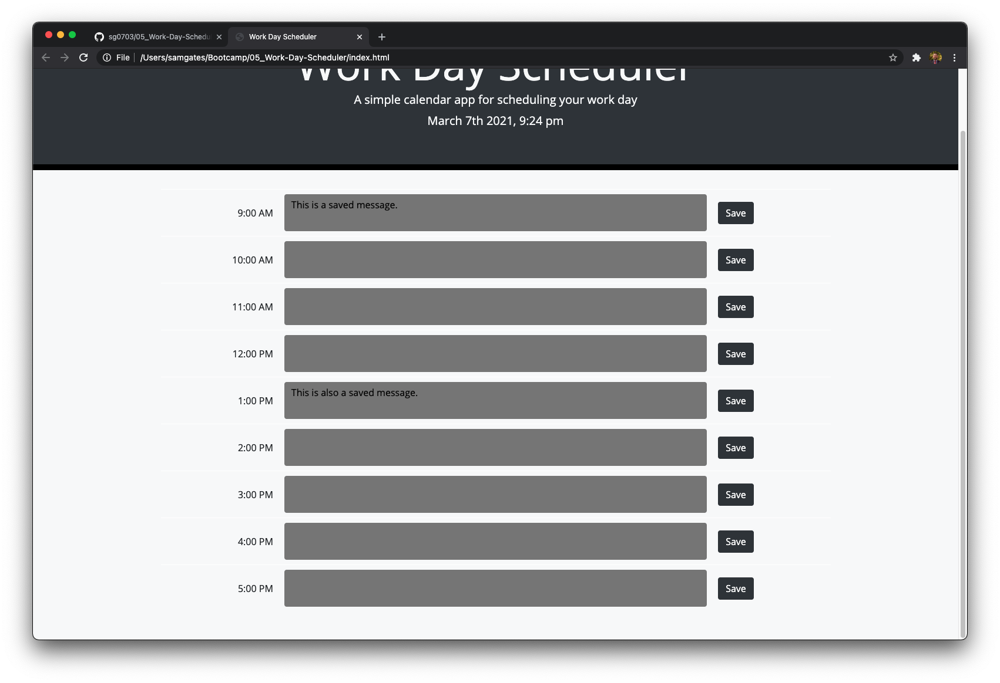

# Work Day Scheduler (3/7/21)

## Description

For this homework assignment, I created a work day task list, broken down by hour. The user first sees a page with the title "Work Day Scheduler" and the current date/time at the top. The user then sees a list broken down by a range of hours. The hours represent a single day. I wrote the code so that the range of hours is configurable to any range within a 24 hour period. The default is 9:00 AM to 5:00 PM. 

The user can enter a task in the text area and click "save" to save the task on the list. Leaving the page does not erase the task - when the user returns, the information is still displayed there. The background color of each textarea containing the task is either gray (past), red (present), or green (future).

I utilized Javascript and jQuery to dynamically generate the list of tasks and the date/time. Moment.js was utilized in this project as well. 

## Actions taken

1. Modified provided index.html to create placeholders for data
2. Wrote a function to display the main page
3. This project relied heavily on Javascript, jQuery, Moment.js and Bootstrap
4. Utilized Bootstrap to create the styling and HTML elements behind the task list
5. Utilized jQuery to dynamically create the list and populate the list with stored tasks
6. Wrote the function saveTask(), which stores the new task or modifies a current task in local storage
7. Wrote the function populateContent(), which populates textareas with the task from local storage (if it exists)
8. Wrote the function taskPresent(), which checks to see if a task is present in local storage and if so, returns the position of that task in the array
9. Wrote the function timePosition() to calculate if a time slot on the list is in the past, present, or future (returns appropriate background color)
10. Utilized GitHub to track changes and store project files

## Link to deployed project

See the deployed project by following this link: https://sg0703.github.io/05_Work-Day-Scheduler/
See the code repository here: https://github.com/sg0703/05_Work-Day-Scheduler

## Screenshots

